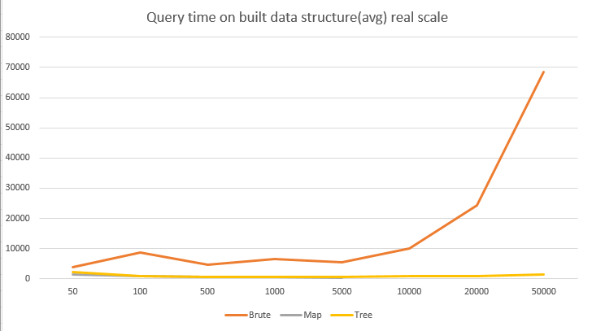
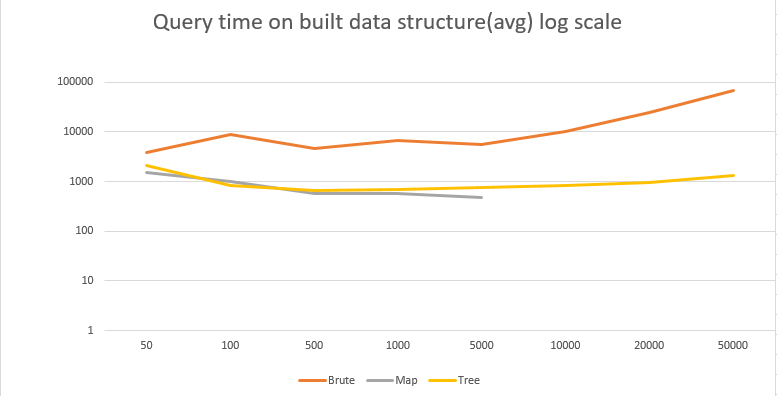
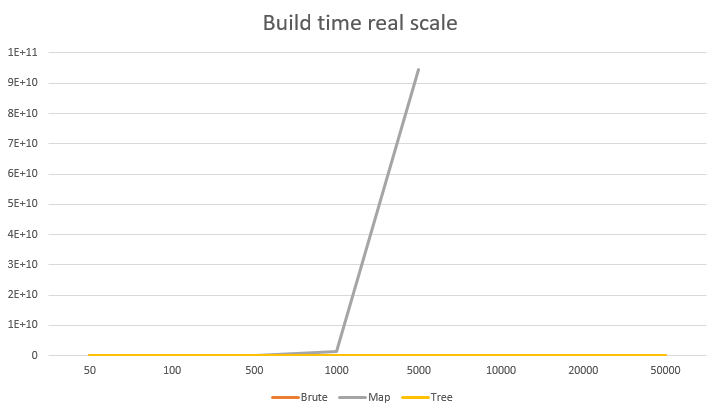
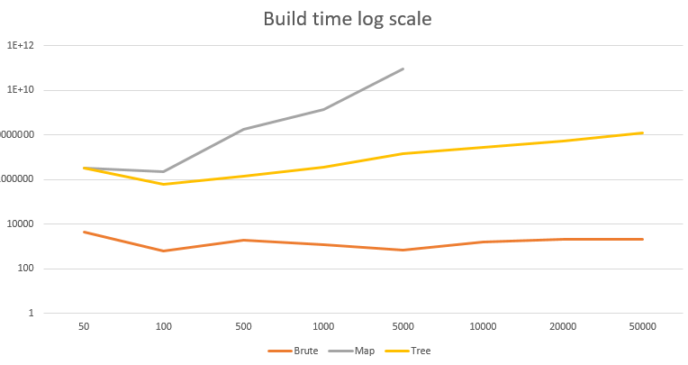

# algorithms-and-data-structures-lab2

# Логин в контесте: aotalanov@edu.hse.ru
## Сравнение производительности алгоритмов по времени.
### Ось x - время выполнения(в наносекундах), Ось y - количество прямоугольников

Как можно заметить алгоритм на карте и алгоритм с использованием персистентного дерева отрезков работают 
гораздо быстрее алгоритма "в лоб". В то время как первому алгоритму надо пройтись по всем 
прямоугольникам, алгоритмы на карте и дереве решают проблему за логарифмическое время, надо всего лишь сжать координаты(в алгоритме
на дереве надо еще найти столбец для координаты). 

## Сравнение алгоритмов по времени построения.
Для алгоритма "в лоб" не нужно время для построения структуры данных(все операции делаются с "сырыми" прямоугольниками), в отличие от других двух.

Мы видим, что алгоритм на дереве строится гараздо быстрее алгоритма на карте, (`O(n * logn)` против `O(n^3)`). Если до 500
прямоугольников это не заметно, то после начинается резкий полиномиальный рост времени построения карты. После 5000 прямоугольников
карта строится настолько долго, что для данного алгоритма метрики не были зафиксированы. 

## Сравнение количества памяти, которую используют алгоритмы.
### Тесты проводились на 5000-х прямоугольниках
Brute: ≈0.818 Mb (массив прямоугольников)

Map: ≈872.541 Mb (массив прямоугольников, матрица координат и два массива сжатых координат)

Tree: ≈10.580 Mb (массив прямоугольников, персистентное дерево и вспомогательные массивы)

Ввиду того что в алгоритме на карте строится матрица всех координат, расходуется огромное количество памяти.

## Выводы.
Сразу можно сказать, что, если точек, которые надо вычислить, мало, можно спокойно пользоваться алгоритмом "в лоб", 
независимо от количества прямоугольников. Он не требует долгого построения структуры данных и вычисляет ответ за приемлемое линейное время.

Если прямоугольников мало(до 500), а запросов много, хорошо подходит алгоритм на карте. Ввиду того, что на вычисление ответа он делает немного меньше операций, 
чем алгоритм на карте, он работает на пару сотен наносекунд быстрее. Если прямоугольников больше, то структура данных строится за непозволительно большое кубическое время.

В остальных(когда много и прямоугольников и точек) случаях алгоритм на персистентном дереве показывает себя лучше всего. 1 раз строится структура данных
за `O(n*log(n))`, а далее значения вычисляются за логарифм(графики могут быть немного обманчивыми, ввиду джавовского garbage collector-а и jit компилятора). Причем памяти расходуется в десятки раз меньше чем на карте.

### P.S.
Код реализации алгоритма на дереве отрезков немного отличается от того, что я отправил в контесте. Ввиду того, что данные я хранил в TreeSet-е(для получения постоянной отсортированности и уникальности элементов) и кастил его к листу, терял много времени. Я это поменял, чтобы скорости были реальные(это буквально пару строк).
